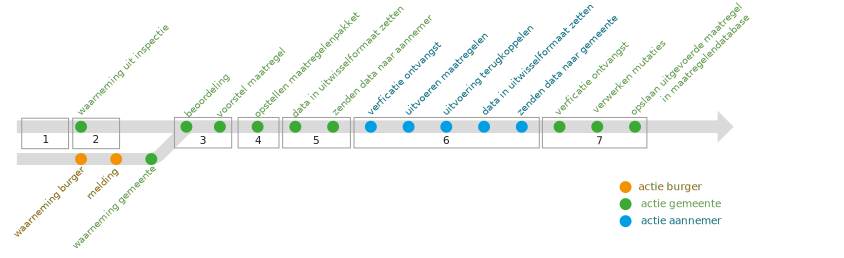

# GWSW Maatregelen

<!-- gebruik voor lokaal editen -->

Vanuit Stichting RIONED is Eric Oosterom de verantwoordelijk projectmanager. Vragen over de module en de totstandkoming en vaststelling ervan kunt u stellen via [gwsw@rioned.org](mailto:gwsw@rioned.org). 

De module GWSW-Maatregelen is in opdracht van Stichting RIONED ontwikkeld door Hans van Keeken en Roel Golsteijn (beiden Kragten), in samenwerking met de werkgroep GWSW-Maatregelen (hierna te noemen “werkgroep”), bestaande uit:
- Walter Kuhn, gemeente Almere
- Leo Bloedjes, gemeente Almere
- Alex Buijs, gemeente Breda
- Eric van Gorkom, I-sago en gemeente Roosendaal
- Wouter van Riel, Infralytics en GWSW-modelleerteam namens Stichting RIONED
- Erwin Schreve, namens gemeente Leiden
- John Wouters, gemeente Rotterdam
- Steven Oterdoom, gemeente Zaandam

# Inleiding

## Achtergrond en inleiding

De afgelopen jaren heeft er een flinke inhaalslag plaatsgevonden in standaardisatie van beheer en onderhoud van de riolering. Er zijn andere normen van toepassing verklaard, er zijn nieuwe normen opgesteld, binnen het CROW heeft een actualisatie van de hoofdstukken voor rioolrenovatie, reiniging en inspectie plaatsgevonden en Stichting RIONED heeft de “Leidraad voor het visueel inspecteren van de buitenriolering volgens NEN-EN 13508-2” (document 2023-01), het rapport “Classificeren van toestandsaspecten van rioolleidingen en -putten vastgelegd volgens NEN-EN 13508-2” (document 2019-02) met de bijbehorende classificatiemethodiek en het “Model Programma van Eisen visuele inspectie” (document 2019-03) opgesteld.

Binnen het gehele proces van beheer, onderhoud en vervanging van de riolering heeft een opdrachtgever te maken met verschillende stakeholders. Dit kunnen afdelingen zijn binnen de eigen organisatie, externe adviseurs en/of uitvoerende partijen. Om alle deelprocessen in goede banen te leiden, is een goede data-uitwisseling essentieel. Het gaat er hierbij om welke data er bij welk proces heen en terug gestuurd moet worden. Hierbij is ***heen*** de datastroom van gemeente naar actienemer en ***terug*** de datastroom van actienemer terug naar gemeente, ofwel het resultaat van de uitgevoerde actie.

Door gebruik te maken van gestandaardiseerde open data en eenduidige terminologie is het mogelijk om op een efficiënte en vergelijkbare wijze de data uit te wisselen. Dit vereenvoudigt en verbetert de processen.

Het Gegevenswoordenboek Stedelijk Water (GWSW) is de open datastandaard waar Stichting RIONED met en namens alle relevante partijen aan werkt. Met het GWSW worden komende jaren alle objecten en hun gegevens, hun onderlinge relaties, en de beheeractiviteiten binnen het domein stedelijk water eenduidig gedefinieerd en vastgelegd ten behoeve van soepele data-uitwisseling en beter beheer. Meer informatie daarover vindt u via [www.riool.net/gwsw](http://www.riool.net/gwsw).

De riolering en een deel van de afvalwaterketen kan al worden beschreven met het GWSW (o.a. Basis en Minimale Dataset, Rib en RibX, Hyd). GWSW-Maatregelen is in het verleden al een keer in concept opgesteld, maar is destijds niet vastgesteld.

Vanuit gebruikers is aan Stichting RIONED gevraagd om het GWSW geschikt te maken om als bron te dienen voor de uitwisseling op het gebied van maatregelen. Dit wordt beschreven in GWSW-Maatregelen, waarvan dit document de specificatie is. GWSW-Maatregelen is opgebouwd uit meerdere onderdelen:

1. Semantiek (uniforme termen en definities, woordenboek, de taal van mensen gestructureerd zodat applicaties/machines het ook kunnen gebruiken) en ordening in een soortenboom
2. Registratie van objecten/projecten/maatregelen (= minimale datasets en optionele velden), bedoeld voor uitwisselen en delen
3. Validatie van (project)datasets (=kwaliteitseisen, conformiteitsklassen)

Onderdelen 1 en 2 zijn uitgewerkt in hoofdstukken 2, 3 en 4. Onderdeel 3 is nog niet uitgewerkt in dit document. Dat volgt na vaststelling van onderdeel 2.

Dit beschrijvende document is begin 2023 opgeleverd door de werkgroep voor toetsing door een grotere groep rioleringsbeheerders, adviseurs en aannemers in het voorjaar van 2023. Vervolgens zal in een aantal proefprojecten bij enkele gemeenten in samenwerking met de daar werkzame marktpartijen de specificatie van GWSW-Maatregelen getoetst worden op werkbaarheid en volledigheid. Ook zal getoetst worden welke potentiële knelpunten in beheer- en andere software zou kunnen optreden. Belangstellenden om ook in hun situatie een proefneming te doen, kunnen zich melden via gwsw@rioned.org.

Beoogd is in 2024 een verbeterde versie van deze specificatie van GWSW-Maatregelen op te leveren voor consultatie en uiteindelijk vaststelling in een volgende versie van het Gegevenswoordenboek Stedelijk Water.

De algemene beschrijving van het GWSW model vindt u op [data.gwsw.nl](https://data.gwsw.nl/). De datamodellen GWSW-Basis en Minimale Dataset (operationeel beheer), GWSW-Rib en RibX (inspectie en reiniging van leidingen, putten en kolken), GWSW-Hyd (hydraulische modellering), GWSW-Kengetallen (afvalwaterprognoses) en GWSW-Geo (GIS-toepassingen) zijn al eerder vastgestelde onderdelen van het GWSW. Een set van basistools rondom GWSW vindt u op [apps.gwsw.nl](http://apps.gwsw.nl/). Voor de details van het datamodel zie [data.gwsw.nl/maatregelen](https://data.gwsw.nl/maatregelen).

## Doelstelling
De doelstelling van deze module is tweeledig. 

Enerzijds moet de module voorzien in voldoende termen en definities, zodat een beheerder voldoende inzicht heeft in de historie van uitgevoerde maatregelen op zijn objecten. Dat houdt het volgende in:
- Welke stakeholders zijn bij welke projecten betrokken?
- Wanneer is welke maatregel bij welk object (object = ieder mogelijk object uit de soortenboom waarop maatregelen uitgevoerd kunnen worden) uitgevoerd?
- Welke resultaten zijn er door de genomen maatregelen bewerkstelligd (liner, reparatie, toestandsverbetering)?

Anderzijds moet de module voorzien in een specificatie voor het uitwisselen van gegevens op projectniveau. Een voorbeeld specifiek voor reinigen en inspecteren is de RibX-specificatie. Hierin moet het volgende zijn opgenomen:
- De definitie van een project waarbinnen de maatregel(en) worden uitgevoerd en waarmee een aannemer aan de slag kan. In andere woorden: het uitwisselbestand 'heen' voor een aannemer.
- De definitie van een projectresultaat. In andere woorden: het uitwisselbestand 'terug'

Een derde belangrijk onderdeel is de uitwerking van de diverse processen die het 'maatregelenproces' beschrijven (waarnemen, beoordelen, maatregelen opstellen, uitvoeren en evalueren). In dit document zullen enkele van de genoemde processen uitgewerkt worden. Een volledige uitwerking van deze processen is reeds beschreven in het [proefschrift van Aad Oomens (1992)](https://repository.tudelft.nl/islandora/object/uuid%3Ab8fbea08-0ec0-4987-85b5-bf5aa6aaec42). Vooralsnog worden deze processen niet in het GWSW opgenomen.

## Scope

De scope van GWSW-maatregelen is beperkt tot activiteiten aan bestaande objecten. Het aanleggen van objecten, zoals riolering aanleggen bij nieuwbouwwijken, valt vooralsnog buiten de scope van GWSW-Maatregelen en kan in een later stadium als uitbreiding worden meegenomen.

Het vaststellen van een uitwisselformaat, zoals orox, csv, xml of anderszins, ligt buiten de scope van de werkgroep.

## Leeswijzer

In hoofdstuk 2 zijn de maatregeltypen beschreven. De conclusie uit de werkgroep overleggen is dat de omschrijving van de maatregelen zo vereenvoudigd als mogelijk plaats dient te vinden, doch gebruik te maken van een nadere uitsplitsing van maatregelen indien daar behoefte aan is.

In hoofdstuk 3 zijn de verschillende processtappen beschreven in het beheer, onderhoud, renovatie en vervanging van de riolering en op welke momenten data-uitwisseling plaats vindt.

In hoofdstuk 4 zijn de processtappen nader beschreven en is per processtap aangegeven welke data er heen en terug gestuurd dient te worden om deze processen in goede banen te leiden. De informatiebehoefte is in tabelvorm uitgewerkt.

# Omschrijving maatregelen

In de eerste (concept-)versie van GWSW-maatregelen voor vrijverval rioolleidingen en putten van een aantal jaren geleden zijn onder de activiteit Maatregel onderstaande maatregelen gegroepeerd.

- Aanleggen
- Buiten gebruik stellen
- Conserveren
- Onderhouden
- Onderzoeken
- Renoveren
- Repareren
- Vervangen
- Verwijderen

Voor ieder van deze maatregelen is een verdere subtypering aangebracht. In deze subtypering is veelal zijn de maatregelen opgbouwd uit de samenvoeging van de maatregel met het object of met het toestandsaspect. Zo is bijvoorbeeld bij het maatregeltype vervangen onderscheid gemaakt in de subtypes:
-   Rioolput vergroten
-   Rioolput vervangen
-   Vrijverval rioolleiding vervangen
    -   Sleufloos vervangen
        -   Pipe bursting
        -   Pipe eating

In de aanloop naar deze actualisatie van GWSW-Maatregelen is binnen de werkgroep nagedacht in hoeverre deze concept-opzet bruikbaar is. Door het maatregeltype “vervangen” te koppelen aan een fysiek object, én gebruik te maken van de headergegevens uit het GWSW-RibX, ligt de maatregel automatisch vast. Ditzelfde geldt voor maatregelen aan toestandsaspecten. Door het subtype “vrijmaken leidingprofiel” van de maatregel “Onderhouden” te koppelen aan een toestandsaspect, ligt ook hiermee automatisch vast dat het gaat om het verwijderen van een doorgestoken inlaat, wortels, afzetting of dergelijke.

De conclusie uit de werkgroep is dat door de maatregel op een zo hoog mogelijk niveau in de soortenboom te beschrijven en deze te koppelen aan een object of aan een toestandsaspect, er een flinke vereenvoudiging kan plaatsvinden. Dit komt de leesbaarheid ten goede en GWSW-Maatregelen is hierdoor toekomstbestendiger omdat niet bij elke wijziging in objecttypen ook meteen de mogelijkheden binnen GWSW-Maatregelen hoeven te worden aangepast.

# Maatregelenproces

## Te onderscheiden processtappen

Binnen het proces van beheer, onderhoud, renovatie en vervangen van de riolering zijn een aantal generieke processtappen te onderscheiden. Als voorbeeld zijn in onderstaande afbeelding acties aan bijvoorbeeld een kolkaansluitleiding opgenomen.

Afbeelding: Voorbeeld acties aan kolkaansluitleiding (Afbeelding afkomstig van Wouter van Riel.)

Vanuit bovenstaande afbeelding kunnen generieke processtappen 1 t/m 7 worden samengevat die gelden voor zowel rioolleidingen als rioolputten:

1.  Initiëren reiniging en inspectie
2.  Uitvoeren reiniging en inspectie en aanleveren waarnemingen
3.  Beoordelen inspecties en opstellen maatregeladvies
4.  Vaststellen definitieve maatregel
5.  Opstellen contract
6.  Uitvoeren maatregelen
7.  Verwerken in beheerdata

Tijdens het uitvoeren van deze processtappen dient er data via een uitwisselbestand heen en terug te worden uitgewisseld. De stappen zijn in de navolgende paragraaf tekstueel uitgewerkt. Stappen 1 en 2 zijn uitvoerig in het GWSW-RibX beschreven en worden hier niet herhaald. Voor deze stappen wordt verwezen naar het huidige GWSW-RibX.

Stap 7, het verwerken van de gegevens in de beheerdata, staat in deze opsomming als laatste stap aangegeven nadat de benodigde maatregelen zijn uitgevoerd. In de praktijk zal bij elke stap telkens ook (een deel van) de beheerdata worden geactualiseerd.

## Processchema

Een voorbeeld van een processchema met de stappen 1 t/m 7 met de daarbij horende data-uitwisseling is in afbeelding 2 weergegeven. In dit schema is geen directe link tussen de verschillende processtappen opgenomen. Uitwisseling geschiedt via de data-uitwisseling plaats met een “Heen” en “Terug” bestand per processtap. Er is bewust voor gekozen om een processtap niet volledig als een stroomschema uit te werken. Processen kunnen per opdrachtgever verschillen en het uitwerken ervan behoort niet tot de scope van GWSW-Maatregelen.

Afbeelding: Processtappen en data-uitwisseling

Het uitgangspunt dat bij afbeelding 2 is gehanteerd, is dat de benodigde controles en hoe om te gaan met verbeteringen, binnen deze processtappen zelf plaats vindt.

Het resultaat van een voorgaande processtap wordt gebruikt als input voor een opvolgende stap. Bij het opstellen van de benodigde data-uitwisseling is data die voor een vervolgstap niet meer nodig is, buiten de dataoverdracht gehouden. Dat houdt in dat een terug bestand uit een voorgaande processtap niet per definitie gelijk hoeft te zijn aan het heen bestand voor de volgende processtap.

Tevens geldt dat aan het initiëren van een reiniging en inspectie (stap 1) ook een contract ten grondslag kan liggen. In dat geval is eerst sprake van het opstellen van een contract (stap 5) voordat een programma reiniging en inspectie wordt geïnitieerd (stap 1). Dit geldt ook bij raamovereenkomsten met zowel reinigen en inspecteren van de riolering als onderhoud/renovatie.

# Dataoverdracht per processtap

De processtappen uit hoofdstuk 3 zijn in hoofdstuk 4 nader uitgewerkt. Per processtap is ook aangegeven welke benodigde data er uitgewisseld dient te worden.

Bij de uit te wisselen data in de navolgende paragrafen is telkens in de laatste kolom onder “betreft” aangegeven om welk soort data het gaat:

- H = Headerdata van het object
- T = Informatie van het toestandsaspect
- P = Projectdata

In de tabellen met dat-uitwisseling staan de vullingsvoorschriften in twee kolommen:

- “Heen”: de veldvulling in een vooraf aangeleverd bestand.
- “Terug”: de veldvulling in een terug te ontvangen bestand (resultaten van het proces).

De kolommen “Heen” en “Terug” gebruiken de volgende codes:

<table>
<caption>Codering voor de vullingsvoorschriften</caption>
</table>

| Code | Voorschrift veldvulling in bestand                                          |
|:-----|:----------------------------------------------------------------------------|
|      | Geen code in kolom “Heen”: Niet vooraf invullen                             |
|      | Geen code in kolom “Terug”: Niet achteraf invullen (terug zonder wijziging) |
| O    | Optioneel                                                                   |
| A    | Altijd                                                                      |

Als voor de kolom “Heen” geldt dat het gegeven verplicht is (A) en het gegeven ontbreekt in het terug te ontvangen bestand, dan moet de opdrachtgever met de opdrachtnemer afspraken maken over de levering. Wanneer het gegeven voor zowel “Heen” als “Terug” verplicht is (A) en het “Heen”-gegeven is fout of ontbreekt (nieuw object, niet vooraf ingevuld), dan moet de opdrachtnemer dit gegeven – als het bekend is – altijd bij de uitvoering van het proces corrigeren of aanvullen.

## Stap 1: Initiëren reiniging en inspectie.

Reiniging en inspectie zijn reeds beschreven in het GWSW-RibX. Zie het uitwisselbestand conform paragraaf 6.3, 6.4 en 6.5 (resp. inspectie leidingen, putten en kolken) uit de beschrijving van het GWSW-RibX ([www.riool.net/ribx](http://www.riool.net/ribx)). Uit analyse van deze tabellen blijkt dat er bij leidingen geen verschil is tussen een rioolleiding en een aansluitleiding. Het GWSW-RibX voor een rioolleiding is identiek aan dat van een aansluitleiding en kent alleen afwijkende veldcodes. In de inhoud van de velden zit geen tegenstrijdigheid.

Tussen een rioolput en een kolk zijn wel verschillen. In de beschrijving van het GWSW-RibX komen velden voor die alleen bij een rioolput gelden en velden die alleen bij een kolk gelden. Overige velden komen met elkaar overeen. Uitzonderingen hierop zijn:

-   Van veld CBG respectievelijk EBG is bij een put dat terug <u>optioneel</u> en bij een kolk <u>verplicht</u>
-   Van veld CCK respectievelijk ECK is bij een put dat terug <u>optioneel</u> en bij een kolk <u>verplicht</u>
-   Veld CCM respectievelijk ECM heeft bij een put een andere betekenis dan bij een kolk.

Behoudens deze uitzondering zitten er geen tegenstrijdigheden in de inhoud van de velden.

Uit de analyse van de informatie uit stap 1 blijkt dat er voor de vervolgstappen in het GWSW-Maatregelen alle benodigde dat uitgewisseld wordt. Er is in deze processtap geen behoefte om extra dat uit te wisselen.

## Stap 2: Uitvoeren reiniging en inspecties en aanlevering waarnemingen.

Stap 2 is eveneens reeds beschreven in het GWSW-RibX. De opdrachtnemer levert na de uitvoering van de werkzaamheden een gevuld GWSW-RibX bestand aan de opdrachtgever. Deze bestaat uit headergegevens, waarnemingen en meetgegevens. Hoe om te gaan met wijzigingen ten opzichte van de heen informatie staat in de beschrijving van het GWSW-RibX verwoord. Bij de kolken zijn aanvullende tabellen gedefinieerd waarin ook al maatregelen opgenomen kunnen worden.

Ook uit de analyse van stap 2 blijkt dat er voor de vervolgstappen in het GWSW-Maatregelen alle benodigde dat uitgewisseld wordt. Er is in deze stap geen behoefte om extra dat uit te wisselen.

## Stap 3: Uitvoeren beoordeling en opstellen maatregeladvies

De opdrachtnemer ontvangt van de opdrachtgever het gevuld GWSW-RibX bestand met headergegevens, waarnemingen en meetgegevens. Om de beoordeling uit te kunnen voeren, dienen de randvoorwaarden door de opdrachtgever te worden aangeleverd. De randvoorwaarden bestaan uit de beoordelingscriteria voor ingrijp- en waarschuwingsmaatstaven en worden eventueel aangevuld met externe zaken zoals hydraulische knelpunten, voorgenomen wegreconstructies en dergelijke. Aan de hand hiervan kan de beoordeling plaatsvinden. De benodigde acties worden op objectniveau (voor het gehele object) of op het niveau van een toestandsaspect (plaatselijke schade) aangegeven. Het resultaat van stap 3 is een maatregeladvies.

Informatie-uitwisseling stap 3

<table>
<caption>Stap 3: beoordelen inspectie / opstellen maatregeladvies</caption>
</table>

| Veld | Heen | Terug | Naam                                                              | Betreft | Toelichting (geen = conform EN 13508-2)                                                                                                                                                                                                                                                                                                                                                                                                                                                                                                                                                                                                                                                                                                                                                                                                                                                                                                                                                                                             |
|------|------|-------|-------------------------------------------------------------------|---------|-------------------------------------------------------------------------------------------------------------------------------------------------------------------------------------------------------------------------------------------------------------------------------------------------------------------------------------------------------------------------------------------------------------------------------------------------------------------------------------------------------------------------------------------------------------------------------------------------------------------------------------------------------------------------------------------------------------------------------------------------------------------------------------------------------------------------------------------------------------------------------------------------------------------------------------------------------------------------------------------------------------------------------------|
| S    | A    | A     | Bevoegde instantie                                                | P       | De opdrachtgever van het project, in veel gevallen de gemeente                                                                                                                                                                                                                                                                                                                                                                                                                                                                                                                                                                                                                                                                                                                                                                                                                                                                                                                                                                      |
| S    | A    | A     | Functiereferentie werkgever                                       | P       | Opdrachtcode van opdrachtgever                                                                                                                                                                                                                                                                                                                                                                                                                                                                                                                                                                                                                                                                                                                                                                                                                                                                                                                                                                                                      |
| 2xS  | A    | A     | Naam adviseur                                                     | P       | Naam beoordelaar en bedrijf                                                                                                                                                                                                                                                                                                                                                                                                                                                                                                                                                                                                                                                                                                                                                                                                                                                                                                                                                                                                         |
| S    | A    | A     | Functiereferentie adviseur                                        | P       | Opdrachtcode van het bedrijf van de beoordelaar                                                                                                                                                                                                                                                                                                                                                                                                                                                                                                                                                                                                                                                                                                                                                                                                                                                                                                                                                                                     |
| D    | A    | A     | Datum                                                             | P       | Datum van oplevering van de beoordeling                                                                                                                                                                                                                                                                                                                                                                                                                                                                                                                                                                                                                                                                                                                                                                                                                                                                                                                                                                                             |
| L=1  | A    | A     | Oorsprong maatregel                                               | P       | 1. Geautomatiseerd toegekend (codes vergelijken)  2. Nader inhoudelijk toegekend (bekijken beeldmateriaal)                                                                                                                                                                                                                                                                                                                                                                                                                                                                                                                                                                                                                                                                                                                                                                                                                                                                                                                       |
| URI  | A    | A     | Inventarisatiegegevens (RibX header A, C en E-codes)              | H       | Betreft de volledige headergegevens van de objecten conform paragraaf 6.3, 6.4 of 6.5 volgens het <a href="https://rioned-web-prod.azurewebsites.net/media/1iljdccy/ribx-formaat-voor-inspectie-en-reiniging.pdf" target="_blank">RibX</a>                                                                                                                                                                                                                                                                                                                                                                                                                                                                                                                                                                                                                                                                                                                                                                                          |
| URI  | A    | A     | Inspectiegegevens (RibX B, D en F-codes)                          | T       | Betreft de volledige inspectie van objecten die voor beoordeling in aanmerking komen.                                                                                                                                                                                                                                                                                                                                                                                                                                                                                                                                                                                                                                                                                                                                                                                                                                                                                                                                               |
| URI  | A    | A     | Bestaat uit identificatiecodes van put of leiding en waarnemingen | T       | Bij maatregelen op toestandsaspecten dienen de riool- en waarneming records hiervan in het terug-bestand te worden geleverd.                                                                                                                                                                                                                                                                                                                                                                                                                                                                                                                                                                                                                                                                                                                                                                                                                                                                                                        |
| URI  | A    | A     | Beoordelingscriteria                                              | P       | Minimale Ingrijp- en waarschuwingsmaatstaven                                                                                                                                                                                                                                                                                                                                                                                                                                                                                                                                                                                                                                                                                                                                                                                                                                                                                                                                                                                        |
| D+S  | A    | A     | Datum / versie beoordelingscriteria                               | P       |                                                                                                                                                                                                                                                                                                                                                                                                                                                                                                                                                                                                                                                                                                                                                                                                                                                                                                                                                                                                                                     |
| L=n  | O    | A     | Randvoorwaarden beoordeling                                       | P       | Bijvoorbeeld voorgenomen reconstructies / clustervorming  De waarde “geen” gebruiken indien er geen aanvullende randvoorwaarden gelden.  1 = Geen  2 = Klachten  3 = Wegbeheer  4 = Hydraulische knelpunten  5 = Nieuwbouwlocatie  6 = Beleid t.a.v. materialen-duurzaamheid-circulariteit  7 = Overig beleid  8 = Risicoprofielen/-kaarten  9 = Grondwaterbeschermingsgebieden  10 = Overige randvoorwaarden                                                                                                                                                                                                                                                                                                                                                                                                                                                                                                                                                                                      |
| D+S  | A    | A     | Datum / versie randvoorwaarden beoordeling                        | P       |                                                                                                                                                                                                                                                                                                                                                                                                                                                                                                                                                                                                                                                                                                                                                                                                                                                                                                                                                                                                                                     |
| L=1  | A    | A     | Maatregel (op (deel)object)                                       | H       | De maatregel (Activiteit) registreren in de headergegevens.  Bij een maatregel op een deelobject altijd het deel van het object benoemen waar het om gaat. Bijvoorbeeld aanbrengen van een stroomprofiel, vervangen putafdekking, etc.  (let wel: deze hebben veel subtypes in het concept GWSW-Maatregelen wat nu geprogrammeerd is)  0 = Geen  ~~1 = Aanleggen (NIET GEBRUIKEN)~~  2 = Buiten gebruik stellen  3 = Conserveren  4 = Onderhouden  4.1 = Frequenter reinigen  ~~4.2 = Vrijmaken leidingprofiel~~  ~~4.3 = Vrijmaken putprofiel~~  5 = Onderzoeken (waaronder monitoren, frequenter inspecteren, boorkernen, etc.)  6 = Renoveren  ~~7 = Repareren (N.V.T.)~~  ~~7.1 = Beton repareren~~  ~~7.2 = Injecteren~~  ~~7.3 = Deelliner plaatsen~~  ~~7.4 = Manchet plaatsen~~  ~~7.5 = Metselwerkvoegen herstellen~~  ~~7.6 = Omstorten, met beton~~  8 = Verbeteren  9 = Vervangen  10 = Verwijderen                                                   |
| L=n  | A    | A     | Maatregel (op toestandsaspect)                                    | T       | De maatregel (activiteit) registreren in de waarnemingen in RibX?.  Er zijn meerdere maatregelen op 1 toestandsaspect mogelijk.  Bij een toestandsaspect binnen een ingrijpmaatstaf welke niet tot een maatregel leidt, de waarde “geen” vermelden.  (let wel: deze hebben veel subtypes in het concept GWSW-Maatregelen wat nu geprogrammeerd is)  0 = Geen  ~~1 = Aanleggen (N.V.T.)~~  ~~2 = Buiten gebruik stellen (N.V.T.)~~  ~~3 = Conserveren (N.V.T.)~~  4 = Onderhouden  ~~4.1 = Frequenter reinigen~~  4.1. Vrijmaken leidingprofiel  4.2. Vrijmaken putprofiel  ~~5 = Onderzoeken (waaronder monitoren, frequenter inspecteren, boorkernen, etc.) (N.V.T.)~~  ~~6 = Renoveren (N.V.T.)~~  7 = Repareren  7.1. Beton repareren  7.2. Injecteren  7.3. Deelliner plaatsen  7.4. Manchet plaatsen  7.5. Metselwerkvoegen herstellen  7.6. Omstorten, met beton  ~~8 = Verbeteren (N.V.T.)~~  ~~9 = Vervangen (N.V.T.)~~  ~~10 = Verwijderen (N.V.T.)~~ |
| S    | A    | O     | Opmerking maatregel (op -onderdeel van het- object)               | H       | Betreft de opmerking van de beoordelaar, clustering altijd vermelden                                                                                                                                                                                                                                                                                                                                                                                                                                                                                                                                                                                                                                                                                                                                                                                                                                                                                                                                                                |
| S    | A    | O     | Opmerking maatregel (op toestandsaspect)                          | T       | Betreft de opmerking van de beoordelaar, bijvoorbeeld foutieve toestandsaspecten                                                                                                                                                                                                                                                                                                                                                                                                                                                                                                                                                                                                                                                                                                                                                                                                                                                                                                                                                    |
| DbDe | A    | A     | Uitvoeringsperiode maatregel op -onderdeel van het- object)       | H       | Betreft de beoogde uitvoeringsperiode naar aanleiding van de beoordeling                                                                                                                                                                                                                                                                                                                                                                                                                                                                                                                                                                                                                                                                                                                                                                                                                                                                                                                                                            |
| DbDe | A    | A     | Uitvoeringsperiode maatregel (op toestandsaspect)                 | T       | Betreft de beoogde uitvoeringsperiode naar aanleiding van de beoordeling                                                                                                                                                                                                                                                                                                                                                                                                                                                                                                                                                                                                                                                                                                                                                                                                                                                                                                                                                            |
| DbDe | O    | A     | Toekomstig materiaal                                              | H       | Terug: Alleen bij vervangen van een (deel)object of aanleg van deelobjecten. Aanleg van een volledig object valt hier buiten                                                                                                                                                                                                                                                                                                                                                                                                                                                                                                                                                                                                                                                                                                                                                                                                                                                                                                        |
| DbDe | O    | A     | Toekomstige vorm                                                  | H       | Terug: Alleen bij vervangen van volledig object (leiding of put)                                                                                                                                                                                                                                                                                                                                                                                                                                                                                                                                                                                                                                                                                                                                                                                                                                                                                                                                                                    |
| DbDe | O    | A     | Toekomstige breedte                                               | H       | Terug: Alleen bij vervangen van volledig object (leiding of put)                                                                                                                                                                                                                                                                                                                                                                                                                                                                                                                                                                                                                                                                                                                                                                                                                                                                                                                                                                    |
| DbDe | O    | A     | Toekomstige hoogte                                                | H       | Terug: Alleen bij vervangen van volledig object (leiding of put)                                                                                                                                                                                                                                                                                                                                                                                                                                                                                                                                                                                                                                                                                                                                                                                                                                                                                                                                                                    |

Stap 4: Vaststellen maatregelplan
---------------------------------

De controleur stelt aan de hand van het maatregeladvies uit stap 3 de definitieve maatregel vast. Voor zover uit de controle van het maatregeladvies een afwijking ten opzichte van het maatregeladvies volgt, dient dit altijd met een opmerking te worden toegelicht. Op die manier is terug te vinden waarom van een advies is afgeweken. Is de definitieve maatregel gelijk aan de geadviseerde maatregel, dan kan dit veld leeg blijven. Het resultaat van stap 4 is een maatregelplan waarin de definitieve maatregelen staan opgenomen.

<table>
<caption>Stap 4: Vaststellen definitieve maatregel (toegevoegde velden tov stap 3)</caption>
</table>

| Veld | Heen | Terug | Naam                                                              | Betreft | Toelichting (geen = conform EN 13508-2)                                                                                                                                                                                                                                                                                                                                                                                                                                                                                                                                                                                                                                                                                                                                                                                                                                             |
|------|------|-------|-------------------------------------------------------------------|---------|-------------------------------------------------------------------------------------------------------------------------------------------------------------------------------------------------------------------------------------------------------------------------------------------------------------------------------------------------------------------------------------------------------------------------------------------------------------------------------------------------------------------------------------------------------------------------------------------------------------------------------------------------------------------------------------------------------------------------------------------------------------------------------------------------------------------------------------------------------------------------------------|
| S    | A    | A     | Bevoegde instantie                                                | P       | De opdrachtgever van het project, in veel gevallen de gemeente                                                                                                                                                                                                                                                                                                                                                                                                                                                                                                                                                                                                                                                                                                                                                                                                                      |
| S    | A    | A     | Functiereferentie werkgever                                       | P       | Opdrachtcode van opdrachtgever                                                                                                                                                                                                                                                                                                                                                                                                                                                                                                                                                                                                                                                                                                                                                                                                                                                      |
| D    | A    | A     | Datum                                                             | P       | Heen: Datum van oplevering van de beoordeling  Terug: Datum van vaststellen definitieve maatregel                                                                                                                                                                                                                                                                                                                                                                                                                                                                                                                                                                                                                                                                                                                                                                                |
| L=1  | A    | A     | Oorsprong maatregel                                               | P       | 1. Geautomatiseerd toegekend (codes vergelijken)  2. Nader inhoudelijk toegekend (bekijken beeldmateriaal)                                                                                                                                                                                                                                                                                                                                                                                                                                                                                                                                                                                                                                                                                                                                                                       |
| URI  | A    | A     | Inventarisatiegegevens (RibX header A, C en E-codes)              | H       | Betreft de volledige headergegevens van de objecten conform paragraaf 6.3, 6.4 of 6.5 volgens het <a href="https://rioned-web-prod.azurewebsites.net/media/1iljdccy/ribx-formaat-voor-inspectie-en-reiniging.pdf" target="_blank">RibX</a>                                                                                                                                                                                                                                                                                                                                                                                                                                                                                                                                                                                                                                          |
| URI  | A    | A     | Inspectiegegevens (RibX B, D en F-codes)                          | T       | Betreft de volledige inspectie van objecten die voor beoordeling in aanmerking komen.                                                                                                                                                                                                                                                                                                                                                                                                                                                                                                                                                                                                                                                                                                                                                                                               |
| URI  | A    | A     | Bestaat uit identificatiecodes van put of leiding en waarnemingen | T       | Bij maatregelen op toestandsaspecten dienen de riool- en waarneming records hiervan in het terug-bestand te worden geleverd.                                                                                                                                                                                                                                                                                                                                                                                                                                                                                                                                                                                                                                                                                                                                                        |
| URI  | A    | A     | Beoordelingscriteria                                              | P       | Minimale Ingrijp- en waarschuwingsmaatstaven   Afwijkingen tov stap 3 verplicht vermelden; anders “heen” ook mee “terug” leveren                                                                                                                                                                                                                                                                                                                                                                                                                                                                                                                                                                                                                                                                                                                                                 |
| D+S  | A    | A     | Datum / versie beoordelingscriteria                               | P       | Afwijkingen tov stap 3 verplicht vermelden                                                                                                                                                                                                                                                                                                                                                                                                                                                                                                                                                                                                                                                                                                                                                                                                                                          |
| L=n  | A    | A     | Randvoorwaarden beoordeling                                       | P       | Afwijkingen tov stap 3 verplicht vermelden                                                                                                                                                                                                                                                                                                                                                                                                                                                                                                                                                                                                                                                                                                                                                                                                                                          |
| D+S  | A    | A     | Datum / versie randvoorwaarden beoordeling                        | P       | Afwijkingen tov stap 3 verplicht vermelden                                                                                                                                                                                                                                                                                                                                                                                                                                                                                                                                                                                                                                                                                                                                                                                                                                          |
| L=1  | A    | A     | Maatregel (op (deel)object)                                       | H       | Heen: de voorgestelde maatregel uit stap 3.   Terug: Betreft in stap 4 de definitieve maatregel (op -onderdeel van het- object) na controle door de controleur.   Wijkt de maatregel af van stap 3, dan is het opmerkingveld verplicht.  0 = Geen  ~~1 = Aanleggen (NIET GEBRUIKEN)~~  2 = Buiten gebruik stellen  3 = Conserveren  4 = Onderhouden  4.1 = Frequenter reinigen  ~~4.2 = Vrijmaken leidingprofiel~~  ~~4.3 = Vrijmaken putprofiel~~  5 = Onderzoeken (waaronder monitoren, frequenter inspecteren, boorkernen, etc.)  6 = Renoveren  ~~7 = Repareren (N.V.T.)~~  ~~7.1 = Beton repareren~~  ~~7.2 = Injecteren~~  ~~7.3 = Deelliner plaatsen~~  ~~7.4 = Manchet plaatsen~~  ~~7.5 = Metselwerkvoegen herstellen~~  ~~7.6 = Omstorten, met beton~~  8 = Verbeteren  9 = Vervangen  10 = Verwijderen |
| L=n  | A    | A     | Maatregel (op toestandsaspect)                                    | T       | Heen: Het maatregeladvies uit stap 3.   Terug: Betreft in stap 4 de definitieve maatregel (op toestandsaspect) na controle door de controleur.   0 = Geen  ~~1 = Aanleggen (N.V.T.)~~  ~~2 = Buiten gebruik stellen (N.V.T.)~~  ~~3 = Conserveren (N.V.T.)~~  4 = Onderhouden  ~~4.1 = Frequenter reinigen~~  4.1. Vrijmaken leidingprofiel  4.2. Vrijmaken putprofiel  ~~5 = Onderzoeken (waaronder monitoren, frequenter inspecteren, boorkernen, etc.) (N.V.T.)~~  ~~6 = Renoveren (N.V.T.)~~  7 = Repareren  7.1. Beton repareren  7.2. Injecteren  7.3. Deelliner plaatsen  7.4. Manchet plaatsen  7.5. Metselwerkvoegen herstellen  7.6. Omstorten, met beton  ~~8 = Verbeteren (N.V.T.)~~  ~~9 = Vervangen (N.V.T.)~~  ~~10 = Verwijderen (N.V.T.)~~                                                          |
| S    | A    | A     | Opmerking maatregel (op (deel)object)                             | H       | Verplicht veld in stap 4 indien de definitieve maatregel af wijkt van het maatregeladvies uit stap 3.                                                                                                                                                                                                                                                                                                                                                                                                                                                                                                                                                                                                                                                                                                                                                                               |
| S    | A    | A     | Opmerking maatregel (op toestandsaspect)                          | T       | Verplicht veld in stap 4 indien de definitieve maatregel af wijkt van het maatregeladvies uit stap 3.                                                                                                                                                                                                                                                                                                                                                                                                                                                                                                                                                                                                                                                                                                                                                                               |
| DbDe | A    | A     | Uitvoeringsjaar maatregel (op (deel)object)                       | H       | Betreft het beoogd uitvoeringsjaar van de definitieve maatregel  Deze kan afwijken van het maatregeladvies                                                                                                                                                                                                                                                                                                                                                                                                                                                                                                                                                                                                                                                                                                                                                                       |
| DbDe | A    | A     | Uitvoeringsjaar maatregel (op toestandsaspect)                    | T       | Betreft het beoogd uitvoeringsjaar van de definitieve maatregel  Deze kan afwijken van het maatregeladvies                                                                                                                                                                                                                                                                                                                                                                                                                                                                                                                                                                                                                                                                                                                                                                       |
| DbDe | O    | A     | Toekomstig materiaal                                              | H       | Alleen bij vervangen van een (deel)object of aanleg van deelobjecten. Aanleg van een volledig object valt hier buiten. Afwijkingen ten opzichte van stap 3 verplicht vermelden                                                                                                                                                                                                                                                                                                                                                                                                                                                                                                                                                                                                                                                                                                      |
| DbDe | O    | A     | Toekomstige vorm                                                  | H       | Alleen bij vervangen van volledig object (leiding of put)  Afwijkingen ten opzichte van stap 3 verplicht vermelden                                                                                                                                                                                                                                                                                                                                                                                                                                                                                                                                                                                                                                                                                                                                                               |
| DbDe | O    | A     | Toekomstige breedte                                               | H       | Alleen bij vervangen van volledig object (leiding of put)  Afwijkingen ten opzichte van stap 3 verplicht vermelden                                                                                                                                                                                                                                                                                                                                                                                                                                                                                                                                                                                                                                                                                                                                                               |
| DbDe | O    | A     | Toekomstige hoogte                                                | H       | Alleen bij vervangen van volledig object (leiding of put)  Afwijkingen ten opzichte van stap 3 verplicht vermelden                                                                                                                                                                                                                                                                                                                                                                                                                                                                                                                                                                                                                                                                                                                                                               |

Stap 5: Opstellen contract ten behoeve van uitvoering
-----------------------------------------------------

Voor het geval sprake is van losse (kleinere) opdrachten, kan stap 5 achterwege gelaten worden. In dat geval geldt het “Terug” bestand van stap 4 als “Heen” bestand voor stap 6.

In stap 5 is de uitwisseling beschreven ten behoeve van het opstellen van een contract voor de uit te voeren maatregelen. Deze kunnen gebaseerd zijn op meerdere beoordelingen. Is dat het geval dan dient het maatregeladvies van al deze beoordelingen als “Heen” bestand te worden aangeleverd. De opdrachtgever levert aan de opdrachtnemer de selectie van de maatregeladviezen welke in het contract opgenomen dienen te worden.

In de praktijk worden vaak de volledige GWSW-RibX bestanden aangeleverd, waarin ook objecten zijn opgenomen waar geen maatregelen nodig zijn. Het advies is om alleen die objecten aan te leveren waar maatregelen nodig zijn om verwarring te voorkomen.

Bij vervanging van (deel)objecten dienen gegevens van het nieuwe (deel)object te worden bepaald. Dit zijn onder andere toekomstige vorm, breedte, hoogte, materiaal en verharding. In geval van renovatie dienen de parameters ten behoeve van het ontwerp te worden aangeleverd.

Het kan voorkomen dat de definitieve maatregel uit stap 4 niet de uiteindelijke maatregel is welke in het contract opgenomen wordt. In dat geval dient de maatregel te worden aangepast en dient middels een opmerking de motivatie van deze wijziging te worden vermeld. Het resultaat van stap 5 is een contract dat uitgevoerd kan worden.

<table>
<caption>Stap 5: Opstellen contract (toegevoegde velden tov stap 4)</caption>
</table>

| Veld | Heen | Terug | Naam                                                              | Betreft | Toelichting (geen = conform EN 13508-2)                                                                                                                                                                                                                                                                                                                                                                                                                                                                                                                                                                                                                                                                                                                                                                                                                                                               |
|------|------|-------|-------------------------------------------------------------------|---------|-------------------------------------------------------------------------------------------------------------------------------------------------------------------------------------------------------------------------------------------------------------------------------------------------------------------------------------------------------------------------------------------------------------------------------------------------------------------------------------------------------------------------------------------------------------------------------------------------------------------------------------------------------------------------------------------------------------------------------------------------------------------------------------------------------------------------------------------------------------------------------------------------------|
| S    | A    | A     | Bevoegde instantie                                                | P       | De opdrachtgever van het project, in veel gevallen de gemeente                                                                                                                                                                                                                                                                                                                                                                                                                                                                                                                                                                                                                                                                                                                                                                                                                                        |
| S    | A    | A     | Functiereferentie werkgever                                       | P       | Opdrachtcode van opdrachtgever                                                                                                                                                                                                                                                                                                                                                                                                                                                                                                                                                                                                                                                                                                                                                                                                                                                                        |
| URI  | A    | A     | Inventarisatiegegevens (RibX header A, C en E-codes)              | H       | Betreft de volledige headergegevens van de objecten conform paragraaf 6.3, 6.4 of 6.5 volgens het <a href="https://rioned-web-prod.azurewebsites.net/media/1iljdccy/ribx-formaat-voor-inspectie-en-reiniging.pdf" target="_blank">RibX</a> (of een selectie van objecten) die in het contract worden opgenomen.                                                                                                                                                                                                                                                                                                                                                                                                                                                                                                                                                                                       |
| URI  | A    | A     | Inspectiegegevens (RibX B, D en F-codes)                          | T       | Betreft de volledige inspectie van objecten die voor beoordeling in aanmerking komen.                                                                                                                                                                                                                                                                                                                                                                                                                                                                                                                                                                                                                                                                                                                                                                                                                 |
| URI  | A    | A     | Bestaat uit identificatiecodes van put of leiding en waarnemingen | T       | Bij maatregelen op toestandsaspecten dienen de riool- en waarneming records hiervan in het terug-bestand te worden geleverd.                                                                                                                                                                                                                                                                                                                                                                                                                                                                                                                                                                                                                                                                                                                                                                          |
| URI  | A    | A     | Beoordelingscriteria                                              | P       | Afwijkingen ten opzichte van stap 4 verplicht vermelden                                                                                                                                                                                                                                                                                                                                                                                                                                                                                                                                                                                                                                                                                                                                                                                                                                               |
| D+S  | A    | A     | Datum / versie beoordelingscriteria                               | P       | Afwijkingen ten opzichte van stap 4 verplicht vermelden                                                                                                                                                                                                                                                                                                                                                                                                                                                                                                                                                                                                                                                                                                                                                                                                                                               |
| L=n  | A    | A     | Randvoorwaarden beoordeling                                       | P       | Afwijkingen ten opzichte van stap 4 verplicht vermelden                                                                                                                                                                                                                                                                                                                                                                                                                                                                                                                                                                                                                                                                                                                                                                                                                                               |
| D+S  | A    | A     | Datum / versie randvoorwaarden beoordeling                        | P       | Afwijkingen ten opzichte van stap 4 verplicht vermelden                                                                                                                                                                                                                                                                                                                                                                                                                                                                                                                                                                                                                                                                                                                                                                                                                                               |
| L=1  | A    | A     | Maatregel (op (deel)object)                                       | H       | Heen: de definitieve maatregel uit stap 4.   Terug: Betreft in stap 5 de maatregel (op (deel)object) welke in het contract wordt opgenomen. De contractmaatregel kan afwijken van de definitieve maatregel uit stap 4.   0 = Geen  ~~1 = Aanleggen (NIET GEBRUIKEN)~~  2 = Buiten gebruik stellen  3 = Conserveren  4 = Onderhouden  4.1 = Frequenter reinigen  ~~4.2 = Vrijmaken leidingprofiel~~  ~~4.3 = Vrijmaken putprofiel~~  5 = Onderzoeken (waaronder monitoren, frequenter inspecteren, boorkernen, etc.)  6 = Renoveren  ~~7 = Repareren (N.V.T.)~~  ~~7.1 = Beton repareren~~  ~~7.2 = Injecteren~~  ~~7.3 = Deelliner plaatsen~~  ~~7.4 = Manchet plaatsen~~  ~~7.5 = Metselwerkvoegen herstellen~~  ~~7.6 = Omstorten, met beton~~  8 = Verbeteren  9 = Vervangen  10 = Verwijderen                                      |
| L=n  | A    | A     | Maatregel (op toestandsaspect)                                    | T       | Heen: de definitieve maatregel uit stap 4.   Terug: Betreft in stap 5 de maatregel (op toestandsaspect) welke in het contract wordt opgenomen. De contractmaatregel kan afwijken van de definitieve maatregel uit stap 4.   0 = Geen  ~~1 = Aanleggen (N.V.T.)~~  ~~2 = Buiten gebruik stellen (N.V.T.)~~  ~~3 = Conserveren (N.V.T.)~~  4 = Onderhouden  ~~4.1 = Frequenter reinigen~~  4.1. Vrijmaken leidingprofiel  4.2. Vrijmaken putprofiel  ~~5 = Onderzoeken (waaronder monitoren, frequenter inspecteren, boorkernen, etc.) (N.V.T.)~~  ~~6 = Renoveren (N.V.T.)~~  7 = Repareren  7.1. Beton repareren  7.2. Injecteren  7.3. Deelliner plaatsen  7.4. Manchet plaatsen  7.5. Metselwerkvoegen herstellen  7.6. Omstorten, met beton  ~~8 = Verbeteren (N.V.T.)~~  ~~9 = Vervangen (N.V.T.)~~  ~~10 = Verwijderen (N.V.T.)~~ |
| S    | A    | A     | Opmerking maatregel (op (deel)object)                             | H       | Verplicht veld in stap 5 indien de contractmaatregel af wijkt van de definitieve maatregel uit stap 4.                                                                                                                                                                                                                                                                                                                                                                                                                                                                                                                                                                                                                                                                                                                                                                                                |
| S    | A    | A     | Opmerking maatregel (op toestandsaspect)                          | T       | Verplicht veld in stap 5 indien de contractmaatregel af wijkt van de definitieve maatregel uit stap 4.                                                                                                                                                                                                                                                                                                                                                                                                                                                                                                                                                                                                                                                                                                                                                                                                |
| DbDe | A    | A     | Uitvoeringsjaar maatregel op (deel)object)                        | H       | Betreft het beoogd uitvoeringsjaar volgens (meerjaren)contract                                                                                                                                                                                                                                                                                                                                                                                                                                                                                                                                                                                                                                                                                                                                                                                                                                        |
| DbDe | A    | A     | Uitvoeringsjaar maatregel (op toestandsaspect)                    | T       | Betreft het beoogd uitvoeringsjaar volgens (meerjaren)contract                                                                                                                                                                                                                                                                                                                                                                                                                                                                                                                                                                                                                                                                                                                                                                                                                                        |
| DbDe | A    | A     | Toekomstig materiaal                                              | H       | Alleen bij vervangen van een (deel)object of aanleg van deelobjecten. Aanleg van een volledig object valt hier buiten.  Afwijkingen ten opzichter van stap 4 verplicht vermelden                                                                                                                                                                                                                                                                                                                                                                                                                                                                                                                                                                                                                                                                                                                   |
| DbDe | A    | A     | Toekomstige vorm                                                  | H       | Alleen bij vervangen van volledig object (leiding of put)  Afwijkingen ten opzichte van stap 4 verplicht vermelden                                                                                                                                                                                                                                                                                                                                                                                                                                                                                                                                                                                                                                                                                                                                                                                 |
| DbDe | A    | A     | Toekomstige breedte                                               | H       | Alleen bij vervangen van volledig object (leiding of put)  Afwijkingen ten opzichte van stap 4 verplicht vermelden                                                                                                                                                                                                                                                                                                                                                                                                                                                                                                                                                                                                                                                                                                                                                                                 |
| DbDe | A    | A     | Toekomstige hoogte                                                | H       | Alleen bij vervangen van volledig object (leiding of put)  Afwijkingen ten opzichte van stap 4 verplicht vermelden                                                                                                                                                                                                                                                                                                                                                                                                                                                                                                                                                                                                                                                                                                                                                                                 |
| S    | A    | A     | Naam opsteller                                                    | P       | Naam van de contractant en de projectverantwoordelijke                                                                                                                                                                                                                                                                                                                                                                                                                                                                                                                                                                                                                                                                                                                                                                                                                                                                |
| S    | A    | A     | Functiereferentie opsteller                                       | P       | Opdrachtcode van de contractant                                                                                                                                                                                                                                                                                                                                                                                                                                                                                                                                                                                                                                                                                                                                                                                                                                                         |
| D    | A    | A     | Datum contract                                                    | P       |                                                                                                                                                                                                                                                                                                                                                                                                                                                                                                                                                                                                                                                                                                                                                                                                                                                                                                       |
| S    | A    | A     | Kenmerk contract (code en omschrijving)                           | P       | De code die op het contract wordt vermeld zoals besteknummer of vergelijkbaar (de titel die op het contract wordt vermeld).                                                                                                                                                                                                                                                                                                                                                                                                                                                                                                                                                                                                                                                                                                                                                                                                                                                                                                      |

Stap 6: Uitvoering maatregelen
------------------------------

De opdrachtnemer vult informatie ten aanzien van de uitgevoerde maatregelen aan. De informatiebehoefte is sterk afhankelijk of het gaat om een maatregel op een (deel)object of een toestandsaspect. Tijdens de uitvoering kan het zijn dat de maatregel die in het contract is opgenomen, in de praktijk niet uitvoerbaar is en dus aangepast dient te worden. In dat geval dient dit bij de opmerking te worden gemotiveerd. Dit geldt tevens indien een maatregel binnen de opdracht niet uitvoerbaar blijkt te zijn en er geen maatregel is uitgevoerd.

Door een opleveringsinspectie te verlangen, krijgt de opdrachtgever automatisch via waarnemingen de uitgevoerde maatregelen terug. Dit geldt niet voor maatregelen die van buitenaf uitgevoerd zijn. Daarvoor dienen de gegevens handmatig te worden gevuld.

<table>
<caption>Stap 6: Uitvoering maatregelen (toegevoegde velden tov stap 5)</caption>
</table>

| Veld        | Heen | Terug | Naam                                                              | Betreft | Toelichting (geen = conform EN 13508-2)                                                                                                                                                                                                                                                                                                                                                                                                                                                                                                                                                                                                                                                                                                                                                                                                   |
|-------------|------|-------|-------------------------------------------------------------------|---------|-------------------------------------------------------------------------------------------------------------------------------------------------------------------------------------------------------------------------------------------------------------------------------------------------------------------------------------------------------------------------------------------------------------------------------------------------------------------------------------------------------------------------------------------------------------------------------------------------------------------------------------------------------------------------------------------------------------------------------------------------------------------------------------------------------------------------------------------|
| S           | A    | A     | Bevoegde instantie                                                | P       | De opdrachtgever van het project, in veel gevallen de gemeente                                                                                                                                                                                                                                                                                                                                                                                                                                                                                                                                                                                                                                                                                                                                                                            |
| S           | A    | A     | Functiereferentie werkgever                                       | P       | Opdrachtcode van opdrachtgever                                                                                                                                                                                                                                                                                                                                                                                                                                                                                                                                                                                                                                                                                                                                                                                                            |
| URI         | A    | A     | Inventarisatiegegevens (RibX header A, C en E-codes)              | H       | Betreft de volledige headergegevens van de objecten conform paragraaf 6.3, 6.4 of 6.5 volgens het <a href="https://rioned-web-prod.azurewebsites.net/media/1iljdccy/ribx-formaat-voor-inspectie-en-reiniging.pdf" target="_blank">RibX</a>.   Selectie van objecten die in het contract worden opgenomen.                                                                                                                                                                                                                                                                                                                                                                                                                                                                                                                              |
| URI         | A    | A     | Inspectiegegevens (RibX B, D en F-codes)                          | T       | Betreft de volledige inspectie van objecten die voor beoordeling in aanmerking komen.                                                                                                                                                                                                                                                                                                                                                                                                                                                                                                                                                                                                                                                                                                                                                     |
| URI         | A    | A     | Bestaat uit identificatiecodes van put of leiding en waarnemingen | T       | Bij maatregelen op toestandsaspecten dienen de riool- en waarneming records hiervan in het terug-bestand te worden geleverd.                                                                                                                                                                                                                                                                                                                                                                                                                                                                                                                                                                                                                                                                                                              |
| L=1         | A    | A     | Maatregel (op (deel)object)                                       | H       | Heen: De contractmaatregel uit stap 5.   Terug: Betreft in stap 6 de uitgevoerde maatregel (op(deel)object). Deze kan afwijken van de contractmaatregel.   0 = Geen  ~~1 = Aanleggen (NIET GEBRUIKEN)~~  2 = Buiten gebruik stellen  3 = Conserveren  4 = Onderhouden  4.1 = Frequenter reinigen  ~~4.2 = Vrijmaken leidingprofiel~~  ~~4.3 = Vrijmaken putprofiel~~  5 = Onderzoeken (waaronder monitoren, frequenter inspecteren, boorkernen, etc.)  6 = Renoveren  ~~7 = Repareren (N.V.T.)~~  ~~7.1 = Beton repareren~~  ~~7.2 = Injecteren~~  ~~7.3 = Deelliner plaatsen~~  ~~7.4 = Manchet plaatsen~~  ~~7.5 = Metselwerkvoegen herstellen~~  ~~7.6 = Omstorten, met beton~~  8 = Verbeteren  9 = Vervangen  10 = Verwijderen                                        |
| L=n         | A    | A     | Maatregel (op toestandsaspect)                                    | T       | Heen: de contractmaatregel uit stap 5.   Terug: Betreft in stap 6 de uitgevoerde maatregel (op toestandsaspect). Deze kan afwijken van de contract maatregel.   0 = Geen  ~~1 = Aanleggen (N.V.T.)~~  ~~2 = Buiten gebruik stellen (N.V.T.)~~  ~~3 = Conserveren (N.V.T.)~~  4 = Onderhouden  ~~4.1 = Frequenter reinigen~~  4.1. Vrijmaken leidingprofiel  4.2. Vrijmaken putprofiel  ~~5 = Onderzoeken (waaronder monitoren, frequenter inspecteren, boorkernen, etc.) (N.V.T.)~~  ~~6 = Renoveren (N.V.T.)~~  7 = Repareren  7.1. Beton repareren  7.2. Injecteren  7.3. Deelliner plaatsen  7.4. Manchet plaatsen  7.5. Metselwerkvoegen herstellen  7.6. Omstorten, met beton  ~~8 = Verbeteren (N.V.T.)~~  ~~9 = Vervangen (N.V.T.)~~  ~~10 = Verwijderen (N.V.T.)~~ |
| S           | A    | A     | Opmerking maatregel (op (deel)object)                             | H       | Verplicht veld in stap 6 indien de uitgevoerde maatregel af wijkt van de contractmaatregel uit stap 5.                                                                                                                                                                                                                                                                                                                                                                                                                                                                                                                                                                                                                                                                                                                                    |
| S           | A    | A     | Opmerking maatregel (op toestandsaspect)                          | T       | Verplicht veld in stap 6 indien de uitgevoerde maatregel af wijkt van de contractmaatregel uit stap 5.                                                                                                                                                                                                                                                                                                                                                                                                                                                                                                                                                                                                                                                                                                                                    |
| L= max 1    | A    | A     | Materiaal / UITGEVOERD                                            | H       | Heen: de bestaande informatie staat in de headergegevens van het object (veld ACD volgens het RibX).    Terug: Alleen bij vervangen van een deelobject. Aanleg van een volledig (deel)object valt hier buiten.                                                                                                                                                                                                                                                                                                                                                                                                                                                                                                                                                                                                                      |
| L= max1     | A    | A     | Vorm / UITGEVOERD                                                 | H       | Heen: de bestaande informatie staat in de headergegevens van het object (veld ACA volgens het RibX).    Terug: Alleen bij vervangen van een deelobject. Aanleg van een volledig (deel)object valt hier buiten.                                                                                                                                                                                                                                                                                                                                                                                                                                                                                                                                                                                                                      |
| Max = 1 Int | A    | A     | Breedte / UITGEVOERD                                              | H       | Heen: de bestaande informatie staat in de headergegevens van het object (veld ACC volgens het RibX).    Terug: Alleen bij vervangen van een deelobject. Aanleg van een volledig (deel)object valt hier buiten.                                                                                                                                                                                                                                                                                                                                                                                                                                                                                                                                                                                                                      |
| Max = 1 Int | A    | A     | Hoogte / UITGEVOERD                                               | H       | Heen: de bestaande informatie staat in de headergegevens van het object (veld ACB volgens het RibX).    Terug: Alleen bij vervangen van een deelobject. Aanleg van een volledig (deel)object valt hier buiten.                                                                                                                                                                                                                                                                                                                                                                                                                                                                                                                                                                                                                      |
| S           | A    | A     | Naam opsteller                                                    | P       | Naam van de contractant en de projectverantwoordelijke                                                                                                                                                                                                                                                                                                                                                                                                                                                                                                                                                                                                                                                                                                                                                                                    |
| S           | A    | A     | Functiereferentie opsteller                                       | P       | Opdrachtcode van de contractant                                                                                                                                                                                                                                                                                                                                                                                                                                                                                                                                                                                                                                                                                                                                                                                                           |
| D           | A    | A     | Datum contract                                                    | P       |                                                                                                                                                                                                                                                                                                                                                                                                                                                                                                                                                                                                                                                                                                                                                                                                                                           |
| S           | A    | A     | Kenmerk contract (code en omschrijving)                           | P       | De code die op het contract wordt vermeld zoals besteknummer of vergelijkbaar (de titel die op het contract wordt vermeld).                                                                                                                                                                                                                                                                                                                                                                                                                                                                                                                                                                                                                                                                                                               |
| URI         | A    | A     | Parameters t.b.v. ontwerp relinen                                 | H       | Ontwerpparameters voor het ontwerpen van een relining. Opnemen in het contract of een bijlage parameterblad. Dit geldt voor leidngen en putten.                                                                                                                                                                                                                                                                                                                                                                                                                                                                                                                                                                                                                                                                                           |
| URI         | O    | A     | Ontwerp liner                                                     | H       | Betreft de ontwerpberekening met wanddiktes, gedeclareerde waarden en certificering                                                                                                                                                                                                                                                                                                                                                                                                                                                                                                                                                                                                                                                                                                                                                       |
| Long 6      | O    | O     | Bestekspostnummer                                                 | H/T     | Bestekspostnummer uit contract welke overeenkomt met de uit te voeren resultaatsverplichting                                                                                                                                                                                                                                                                                                                                                                                                                                                                                                                                                                                                                                                                                                                                              |
| L= max1     | O    | A     | Soort lining                                                      | H       | Betreft het type lining volgens het GWSW dat is toegepast. Heen: vul dit indien de opdrachtgever een type lining voorschrijft. Dit blijft leeg indien de contractant vrij is in de keuze van lining  Terug: De uitgevoerde lining                                                                                                                                                                                                                                                                                                                                                                                                                                                                                                                                                                                                   |
| L= max1     | O    | A     | Liningmateriaal                                                   | H       | Betreft het materiaal van de lining, bijvoorbeeld glasvezel, naaldvilt etc.  Heen: vul dit indien de opdrachtgever een materiaal lining voorschrijft. Dit blijft leeg indien de contractant vrij is in de keuze van lining   Terug: De uitgevoerde lining                                                                                                                                                                                                                                                                                                                                                                                                                                                                                                                                                                           |
| S           | A    | A     | Naam directie voerende partij                                     | P       | Naam bedrijf en naam van de directievoerder                                                                                                                                                                                                                                                                                                                                                                                                                                                                                                                                                                                                                                                                                                                                                                                               |
| S           | A    | A     | Contractcode directie voerende partij                             | P       | Opdrachtcode van het bedrijf van de directievoerder                                                                                                                                                                                                                                                                                                                                                                                                                                                                                                                                                                                                                                                                                                                                                                                       |
| S           | A    | A     | Naam uitvoerende partij                                           | P       | Naam contractant                                                                                                                                                                                                                                                                                                                                                                                                                                                                                                                                                                                                                                                                                                                                                                                                                          |
| D           | A    | A     | Verificatiedatum (uitgevoerde maatregel)                          | H/T     | De datum dat de uitgevoerde maatregel(en) gecontroleerd is/zijn door de directie voerdende partij                                                                                                                                                                                                                                                                                                                                                                                                                                                                                                                                                                                                                                                                                                                                         |
| L=1         |      | A     | Status uitgevoerde maatregel                                      | H/T     | Controle van de uitgevoerde maatregel.  0 = leeg   1 = akkoord   2 = niet akkoord                                                                                                                                                                                                                                                                                                                                                                                                                                                                                                                                                                                                                                                                                                                                                |
| S           |      | A     | Opmerking status maatregel                                        | H/T     | Opmerking is verplicht indien de status van de maatregel niet akkoord is                                                                                                                                                                                                                                                                                                                                                                                                                                                                                                                                                                                                                                                                                                                                                                  |
| D           | O    | A     | Datum maatregel                                                   | H/T     | Datum van uitvoering van de maatregel                                                                                                                                                                                                                                                                                                                                                                                                                                                                                                                                                                                                                                                                                                                                                                                                     |
| L = min 1   | O    | A     | Informatiedrager                                                  | H       | Zie www.data.gwsw.nl  Inspectierapport RibX (met beelden en/of foto’s)  Revisies  Werktekeningen  Prcoces Verbaal van Opneming  (Bij liners) Rapportage laboratoriumonderzoek                                                                                                                                                                                                                                                                                                                                                                                                                                                                                                                                                                                                                                              |

Stap 7: Verwerken oplevering uitgevoerde maatregelen in beheerpakket.
---------------------------------------------------------------------

In deze stap is beschreven welke gegevens uiteindelijk als eindresultaat in de beheerdata verwerkt dient te worden nadat de benodigde maatregelen zijn uitgevoerd. In de praktijk zal bij elke voorgaande stap telkens ook (een deel van) de beheerdata worden verrijkt met dat uit deze stappen.

<table>
<caption>Stap 7: Verwerken in beheerdata (toegevoegde velden tov stap 6; de stap van controle op de uitvoering is geborgd door D&T)</caption>
</table>

| Veld        | Heen | Terug | Naam                                                | Betreft | Toelichting (geen = conform EN 13508-2)                                                                                                                                                                                                                                                                                                                                                                                                                                                                                                                                                                                                                                                                       |
|-------------|------|-------|-----------------------------------------------------|---------|---------------------------------------------------------------------------------------------------------------------------------------------------------------------------------------------------------------------------------------------------------------------------------------------------------------------------------------------------------------------------------------------------------------------------------------------------------------------------------------------------------------------------------------------------------------------------------------------------------------------------------------------------------------------------------------------------------------|
| S           | A    | A     | Functiereferentie werkgever                         | P       | Opdrachtcode van opdrachtgever                                                                                                                                                                                                                                                                                                                                                                                                                                                                                                                                                                                                                                                                                |
| L=1         | A    | A     | Maatregel (op -onderdeel van het- object)           | H       | De uitgevoerde maatregel uit stap 6.   0 = Geen  ~~1 = Aanleggen (NIET GEBRUIKEN)~~  2 = Buiten gebruik stellen  3 = Conserveren  4 = Onderhouden  4.1 = Frequenter reinigen  ~~4.2 = Vrijmaken leidingprofiel~~  ~~4.3 = Vrijmaken putprofiel~~  5 = Onderzoeken (waaronder monitoren, frequenter inspecteren, boorkernen, etc.)  6 = Renoveren  ~~7 = Repareren (N.V.T.)~~  ~~7.1 = Beton repareren~~  ~~7.2 = Injecteren~~  ~~7.3 = Deelliner plaatsen~~  ~~7.4 = Manchet plaatsen~~  ~~7.5 = Metselwerkvoegen herstellen~~  ~~7.6 = Omstorten, met beton~~  8 = Verbeteren  9 = Vervangen  10 = Verwijderen                                   |
| L=n         | A    | A     | Maatregel (op toestandsaspect)                      | T       | De uitgevoerde maatregel uit stap 6.   0 = Geen  ~~1 = Aanleggen (N.V.T.)~~  ~~2 = Buiten gebruik stellen (N.V.T.)~~  ~~3 = Conserveren (N.V.T.)~~  4 = Onderhouden  ~~4.1 = Frequenter reinigen~~  4.1. Vrijmaken leidingprofiel  4.2. Vrijmaken putprofiel  ~~5 = Onderzoeken (waaronder monitoren, frequenter inspecteren, boorkernen, etc.) (N.V.T.)~~  ~~6 = Renoveren (N.V.T.)~~  7 = Repareren  7.1. Beton repareren  7.2. Injecteren  7.3. Deelliner plaatsen  7.4. Manchet plaatsen  7.5. Metselwerkvoegen herstellen  7.6. Omstorten, met beton  ~~8 = Verbeteren (N.V.T.)~~  ~~9 = Vervangen (N.V.T.)~~  ~~10 = Verwijderen (N.V.T.)~~ |
| S           | A    | A     | Opmerking maatregel (op -onderdeel van het- object) | H       | Betreft de opmerking uit stap 6 van de uitvoerende partij indien de maatregel af wijkt van de maatregel uit stap 5.                                                                                                                                                                                                                                                                                                                                                                                                                                                                                                                                                                                           |
| S           | A    | A     | Opmerking maatregel (op toestandsaspect)            | T       | Betreft de opmerking uit stap 6 van de uitvoerende partij indien de maatregel af wijkt van de maatregel uit stap 5.                                                                                                                                                                                                                                                                                                                                                                                                                                                                                                                                                                                           |
| L= max 1    | A    | A     | Materiaal / UITGEVOERD                              | H       | Heen: de bestaande informatie staat in de headergegevens van het object (veld ACD volgens het RibX).    Terug: Alleen bij vervangen van een deelobject. Aanleg van een volledig (deel)object valt hier buiten.                                                                                                                                                                                                                                                                                                                                                                                                                                                                                          |
| L= max1     | A    | A     | Vorm / UITGEVOERD                                   | H       | Heen: de bestaande informatie staat in de headergegevens van het object (veld ACA volgens het RibX).    Terug: Alleen bij vervangen van een deelobject. Aanleg van een volledig (deel)object valt hier buiten.                                                                                                                                                                                                                                                                                                                                                                                                                                                                                          |
| Max = 1 Int | A    | A     | Breedte / UITGEVOERD                                | H       | Heen: de bestaande informatie staat in de headergegevens van het object (veld ACC volgens het RibX).    Terug: Alleen bij vervangen van een deelobject. Aanleg van een volledig (deel)object valt hier buiten.                                                                                                                                                                                                                                                                                                                                                                                                                                                                                          |
| Max = 1 Int | A    | A     | Hoogte / UITGEVOERD                                 | H       | Heen: de bestaande informatie staat in de headergegevens van het object (veld ACB volgens het RibX).    Terug: Alleen bij vervangen van een deelobject. Aanleg van een volledig (deel)object valt hier buiten.                                                                                                                                                                                                                                                                                                                                                                                                                                                                                          |
| S           | A    | A     | Kenmerk contract (code en omschrijving)             | P       | De code die op het contract wordt vermeld zoals besteknummer of vergelijkbaar (de titel die op het contract wordt vermeld).                                                                                                                                                                                                                                                                                                                                                                                                                                                                                                                                                                                   |
| URI         | A    | A     | Parameters t.b.v. ontwerp relinen                   | H       | Ontwerpparameters voor het ontwerpen van een relining. Opnemen in het contract of een bijlage parameterblad. Dit geldt voor leidngen en putten.                                                                                                                                                                                                                                                                                                                                                                                                                                                                                                                                                               |
| URI         | A    | A     | Ontwerp liner                                       | H       | Betreft de ontwerpberekening met wanddiktes, gedeclareerde waarden en certificering                                                                                                                                                                                                                                                                                                                                                                                                                                                                                                                                                                                                                           |
| L=1         | A    | A     | Soort lining                                        | H       | Betreft het type lining volgens het GWSW dat is toegepast. Heen: vul dit indien de opdrachtgever een type lining voorschrijft. Dit blijft leeg indien de contractant vrij is in de keuze van lining  Terug: De uitgevoerde lining                                                                                                                                                                                                                                                                                                                                                                                                                                                                       |
| L=1         | A    | A     | Liningmateriaal                                     | H       | Betreft het materiaal van de lining, bijvoorbeeld glasvezel, naaldvilt etc.  Heen: vul dit indien de opdrachtgever een materiaal lining voorschrijft. Dit blijft leeg indien de contractant vrij is in de keuze van lining   Terug: De uitgevoerde lining                                                                                                                                                                                                                                                                                                                                                                                                                                               |
| D           | A    | A     | Verificatiedatum (uitgevoerde maatregel)            | H/T     | De datum dat de uitgevoerde maatregel(en) gecontroleerd is/zijn door de directie voerdende partij                                                                                                                                                                                                                                                                                                                                                                                                                                                                                                                                                                                                             |
| L=1         |      | A     | Status uitgevoerde maatregel                        | H/T     | Controle van de uitgevoerde maatregel.  0 = leeg   1 = akkoord   2 = niet akkoord                                                                                                                                                                                                                                                                                                                                                                                                                                                                                                                                                                                                                    |
| S           |      | A     | Opmerking status maatregel                          | H/T     | Opmerking is verplicht indien de status van de maatregel niet akkoord is                                                                                                                                                                                                                                                                                                                                                                                                                                                                                                                                                                                                                                      |
| D           | A    | A     | Datum maatregel                                     | H/T     | Datum van uitvoering van de maatregel                                                                                                                                                                                                                                                                                                                                                                                                                                                                                                                                                                                                                                                                         |
| L = min 1   | A    | A     | Informatiedrager                                    | H       | Zie www.data.gwsw.nl  Inspectierapport RibX (met beelden en/of foto’s)  Revisies  Werktekeningen  Prcoces Verbaal van Opneming  (Bij liners) Rapportage laboratoriumonderzoek                                                                                                                                                                                                                                                                                                                                                                                                                                                                                                                  |

# UML schema's tbv modellering

### Maatregelenproces

### Initieren reinigen en inspectie

### Beoordelen en opstellen maatregelen

